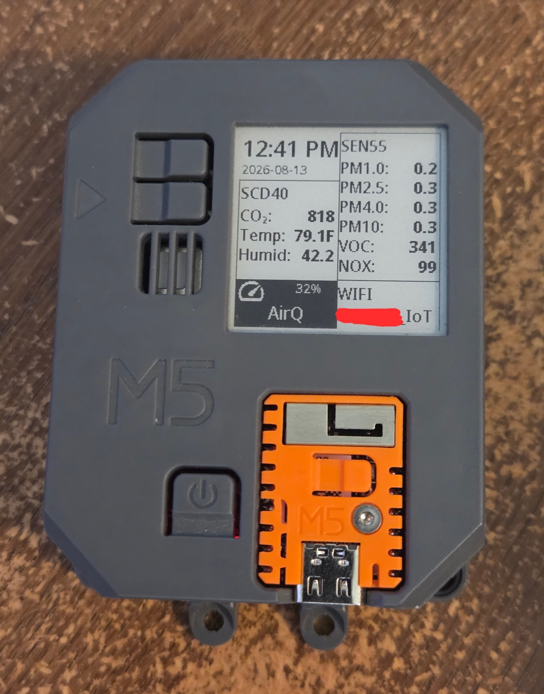

## Product Images




## Description

M5Stack AirQ is an integrated, low-power air quality monitoring device designed to provide comprehensive air quality
monitoring solutions. It features multiple components, including the SEN55 air quality sensor and the SCD40 CO2 sensor,
enabling the monitoring of PM1.0, PM2.5, PM4, PM10 particles, temperature, humidity, VOC, and CO2 concentrations.
Powered by the M5stack StampS3 main controller utilizing ESP32-S3FN8 and equipped with 8M Flash memory.

This ESPHome YAML will enable the ability to display some of the sensor data on the integrated paperwhite display, as
well as send all of the sensor data to Home Assistant.

The device comes with a 1.54-inch e-ink display with a resolution of 200x200, providing a clear visual representation of
the data.

This YAML was adapted from a sample provided by **joshblake87** at
[https://www.reddit.com/r/Esphome/comments/1e2q8jj/m5_stack_airq_air_quality_sensor/](https://www.reddit.com/r/Esphome/comments/1e2q8jj/m5_stack_airq_air_quality_sensor/)

## Known Issues

- **Battery / variants** — [Air Quality](https://docs.m5stack.com/en/core/Air_Quality) and [Air Quality v1.1](https://docs.m5stack.com/en/core/Air_Quality_v1.1) use the same power latch: **GPIO46 (HOLD)** must stay high to run from the onboard **~600 mAh** LiPo when USB is unplugged. The example uses an **internal GPIO switch** (`restore_mode: ALWAYS_ON`, high `setup_priority`) so HOLD is driven during setup, not only in `on_boot`.
- **Battery** — **GPIO14** senses **VBAT/2** (1 MΩ / 1 MΩ divider on the Air Q schematic); the example YAML multiplies by **2** for pack voltage and shows an approximate **%** on the e-ink (linear map **3.4–4.2 V**; calibrate if needed). **`on_value`** on **battery_percent** triggers one extra **`component.update: disp`** the first time a valid % is published **after the 120 s warm-up**; **`warmup_refresh`** also runs that once at warm-up exit if % is already valid. **CHRG**/**STDBY** from the TP4057 are not routed to the ESP, so true “charging” state is not available in firmware.

**Verification:** With a charged battery, flash firmware, then unplug USB — the device should keep running (Wi‑Fi, sensors, display).

### Battery still dies when USB is unplugged?

Work through these in order:

1. **Confirm the firmware you flashed includes HOLD** — The example uses an internal switch on GPIO46 (`restore_mode: ALWAYS_ON`) so the pin is driven high during component setup, not only from `on_boot`. If you merged an older YAML, you may still be missing that block.
2. **Charge the pack** — Leave USB connected until the battery is well charged; a very low cell can brown out as soon as Wi‑Fi or the e‑ink updates.
3. **Wake path** — Per [M5 Air Quality](https://docs.m5stack.com/en/core/Air_Quality) / [v1.1](https://docs.m5stack.com/en/core/Air_Quality_v1.1), after battery wake the MCU must assert HOLD. Boot **from battery** once (USB unplugged, press **WAKE**), then plug USB only to flash; after a successful flash, unplug again and see if it stays on.
4. **Instant off vs reboot loop** — Instant off usually means HOLD never latched or the pack is dead. A **reboot loop** on battery often points to **brownout** (try shorter `update_interval` on the e‑ink, disable `web_server` temporarily, or test with Wi‑Fi `power_save_mode: none` vs light — as experiments, not final recommendations).
5. **Evidence on serial** — With USB connected for logging, unplug and watch whether you see a clean shutdown log or power cuts mid-line; that distinguishes software shutdown from power loss.
6. **Hardware check** — If you can, measure **GPIO46 vs GND** after boot (should be **high** while running). If it never goes high, focus on firmware/pin config; if it stays high but the board still dies, suspect battery or PMIC.

## LED air quality indicator (planned)

The SK6812 LED can reflect overall room air quality (not implemented in the example YAML yet). A practical approach:

1. **Define “overall” state** — Combine signals already in the config: e.g. PM2.5 (`PM2_5`), CO2 (`CO2`), VOC/NOX indices (`voc`, `nox`), or the existing template text sensors `iaq_voc` / `iaq_nox` strings. Alternatively add a **template sensor** with a numeric **0–100** or **1–4** score from weighted thresholds.
2. **Map state to color** — Use green / yellow / orange / red (and optionally blue for “warming up” or offline). Single LED: solid color or low-brightness blink for “bad.”
3. **Update the LED in ESPHome** — Prefer **`on_value`** on a slow-updating template sensor or **`interval`** + script calling `light.turn_on` / `light.control` with `rgb_color` / `brightness` on `id_led`. Avoid updating every second to limit flicker; align with `sensor_interval` or add a **debounce** / **min delta** in the template.
4. **Respect sensor warm-up** — Mirror the display: skip or show **amber** until `uptime_sensor` exceeds ~120 s and critical sensors are valid (`isnan` checks in lambda).
5. **Optional: HA-only** — A **Home Assistant** automation on numeric air-quality entities can call `light.turn_on` on the device entity instead; keeps firmware simple but requires HA online.

Once implemented, document valid **`restore_mode`** values for `esp32_rmt_led_strip` in ESPHome; choose whether the LED should recall its last state after reboot or default to off/on via **`led_restore_mode`**.

## GPIO Pinout

| Pin    | Function                                      |
| ------ | --------------------------------------------- |
| GPIO0  | Button A                                      |
| GPIO1  | Ink Screen Busy                               |
| GPIO2  | Ink Screen RST                                |
| GPIO3  | Ink Screen D/C                                |
| GPIO4  | Ink Screen CS                                 |
| GPIO5  | Ink Screen SCK                                |
| GPIO6  | Ink Screen MOSI                               |
| GPIO8  | Button B                                      |
| GPIO9  | Buzzer                                        |
| GPIO10 | SEN55 power switch (AirPWREN)                 |
| GPIO11 | I2C SDA (SEN55, SCD40, RTC8563)               |
| GPIO12 | I2C SCL                                       |
| GPIO13 | GROVE A SDA                                   |
| GPIO14 | Battery detect (ADC; optional)                |
| GPIO15 | GROVE A SCL                                   |
| GPIO21 | SK6812 LED                                    |
| GPIO26 | Speaker                                       |
| GPIO42 | WAKE (power / RTC wake; input in example)     |
| GPIO46 | **HOLD** — drive high to latch battery power  |

## Example Configuration

```yml
# M5Stack AirQ ESPHome Configuration
# ------------------------------------------
# Before using this configuration:
# 1. Update the substitutions section with your values from Home Assistant:
#    - encryption_key: 32-character key for API encryption
#    - ota_password: Password for OTA updates
#    - ap_password: Password for fallback AP mode (optional)
# 2. Ensure your secrets.yaml contains:
#    wifi_ssid: "YOUR_WIFI_SSID"
#    wifi_password: "YOUR_WIFI_PASSWORD"
# 3. Adjust other substitutions as needed (devicename, location, etc)
# 4. led_restore_mode: RESTORE_AND_OFF (default) or RESTORE_AND_ON after power loss
# 5. fallback_timezone: IANA zone matching Home Assistant (SNTP when HA API is down)
# 6. clock_hours: "24" or "12" (12-hour with AM/PM on the e-ink clock)
# 7. Battery: HOLD on GPIO46 (internal switch ALWAYS_ON). Pack voltage on GPIO14 (÷2 divider ×2 in YAML); % on e-ink uses 3.4–4.2 V → 0–100%.

substitutions:
  devicename: airq
  friendlyname: AirQ
  location: Office
  sensor_interval: 60s
  altitude_compensation: "0m" # Local altitude for CO2 sensor
  temp_offset: -3.0
  temp_time_constant: 1200
  led_restore_mode: RESTORE_AND_OFF
  fallback_timezone: "Europe/Amsterdam"
  clock_hours: "12"

esphome:
  name: ${devicename}
  friendly_name: ${friendlyname}
  area: ${location}
  platformio_options:
    board_build.mcu: esp32s3
    board_build.name: "M5Stack StampS3"
    board_build.upload.flash_size: 8MB
    board_build.upload.maximum_size: 8388608
    board_build.vendor: M5Stack
  on_boot:
    - priority: 800
      then:
        # SEN55 power (G10). HOLD (G46) is latched by switch power_hold (ALWAYS_ON, setup_priority).
        - output.turn_on: enable
    - priority: 200 # after Wi-Fi / sensor init
      then:
        - script.execute: warmup_refresh

esp32:
  variant: esp32s3

globals:
  - id: battery_first_draw_done
    type: bool
    initial_value: "false"

# Default INFO; change to DEBUG (etc.) here when troubleshooting.
logger:
  level: INFO

api:

ota:
  - platform: esphome

wifi:
  ssid: !secret wifi_ssid
  password: !secret wifi_password

  # Enable fallback hotspot (captive portal) in case wifi connection fails
  ap:
    ssid: "${devicename} Fallback Hotspot"

captive_portal:

output:
  - platform: gpio
    pin: GPIO10
    id: enable

# HOLD (GPIO46): latch battery power as early as possible in setup (before long-running stacks).
# on_boot alone can be too late — PMIC may release battery if HOLD is not high soon enough.
switch:
  - platform: gpio
    id: power_hold
    name: HOLD latch
    internal: true
    restore_mode: ALWAYS_ON
    setup_priority: 1000
    pin:
      number: GPIO46
      ignore_strapping_warning: true

web_server:
  port: 80
  include_internal: true

i2c:
  sda: GPIO11
  scl: GPIO12
  scan: true
  frequency: 50kHz
  id: bus_a

spi:
  clk_pin: GPIO05
  mosi_pin: GPIO06

time:
  - platform: homeassistant
    id: ha_time

  - platform: sntp
    id: sntp_time
    timezone: "${fallback_timezone}"
    # Optional: custom NTP servers
    # servers:
    #   - 0.pool.ntp.org
    #   - 1.pool.ntp.org

light:
  - platform: esp32_rmt_led_strip
    rgb_order: GRB
    pin: GPIO21
    num_leds: 1
    chipset: SK6812
    name: "LED"
    restore_mode: ${led_restore_mode}
    id: id_led
    color_correct: [20%, 20%, 20%]

script:
  - id: warmup_refresh
    mode: restart
    then:
      - while:
          condition:
            lambda: |-
              return id(uptime_sensor).state < 120;
          then:
            - component.update: disp
            - delay: 1s
      - if:
          condition:
            lambda: |-
              return !isnan(id(battery_percent).state) && !id(battery_first_draw_done);
          then:
            - globals.set:
                id: battery_first_draw_done
                value: "true"
            - component.update: disp

text_sensor:
  - platform: wifi_info
    ssid:
      name: SSID
      id: ssid

  - platform: template
    name: "VOC IAQ Classification"
    id: iaq_voc
    icon: "mdi:checkbox-marked-circle-outline"
    lambda: |-
      if (int(id(voc).state) < 100.0) {
        return {"Great"};
      }
      else if (int(id(voc).state) <= 200.0) {
        return {"Good"};
      }
      else if (int(id(voc).state) <= 300.0) {
        return {"Light"};
      }
      else if (int(id(voc).state) <= 400.0) {
        return {"Moderate"};
      }
      else if (int(id(voc).state) <= 500.0) {
        return {"Heavy"};
      }
      else {
        return {"unknown"};
      }

  - platform: template
    name: "NOX IAQ Classification"
    id: iaq_nox
    icon: "mdi:checkbox-marked-circle-outline"
    lambda: |-
      if (int(id(nox).state) < 100.0) {
        return {"Great"};
      }
      else if (int(id(nox).state) <= 200.0) {
        return {"Good"};
      }
      else if (int(id(nox).state) <= 300.0) {
        return {"Light"};
      }
      else if (int(id(nox).state) <= 400.0) {
        return {"Moderate"};
      }
      else if (int(id(nox).state) <= 500.0) {
        return {"Heavy"};
      }
      else {
        return {"unknown"};
      }

sensor:
  - platform: uptime
    name: "Uptime"
    id: uptime_sensor
    update_interval: 1s
    internal: true

  # VBAT via 1M/1M divider on G14 → pin voltage ≈ Vpack/2 (M5 Air Q schematic).
  - platform: adc
    pin: GPIO14
    id: battery_voltage
    name: "Battery voltage"
    attenuation: 12db
    update_interval: $sensor_interval
    samples: 4
    filters:
      - median:
          window_size: 5
          send_every: 5
          send_first_at: 1
      - multiply: 2.0
    unit_of_measurement: "V"
    accuracy_decimals: 2
    device_class: voltage
    entity_category: diagnostic

  - platform: template
    name: "Battery level"
    id: battery_percent
    unit_of_measurement: "%"
    accuracy_decimals: 0
    device_class: battery
    state_class: measurement
    update_interval: $sensor_interval
    lambda: |-
      float v = id(battery_voltage).state;
      if (isnan(v)) return {};
      const float v_empty = 3.4f;
      const float v_full = 4.2f;
      if (v >= v_full) return 100.0f;
      if (v <= v_empty) return 0.0f;
      return (v - v_empty) / (v_full - v_empty) * 100.0f;
    # First valid % after warm-up: redraw once so the e-ink bar is not stuck until the next display interval.
    # (Require uptime >= 120 so we do not consume the one shot during the warming-up screen.)
    on_value:
      - if:
          condition:
            lambda: |-
              return !isnan(x) && !id(battery_first_draw_done) && id(uptime_sensor).state >= 120.0f;
          then:
            - globals.set:
                id: battery_first_draw_done
                value: "true"
            - component.update: disp

  - platform: scd4x
    co2:
      name: CO2
      id: CO2
      filters:
        - lambda: |-
            float MIN_VALUE = 300.0;
            float MAX_VALUE = 2500.0;
            if (MIN_VALUE <= x && x <= MAX_VALUE) return x;
            else return {};
    temperature:
      name: CO2 Temperature
      id: CO2_temperature
      filters:
        - lambda: |-
            float MIN_VALUE = -40.0;
            float MAX_VALUE = 100.0;
            if (MIN_VALUE <= x && x <= MAX_VALUE) return x;
            else return {};
    humidity:
      name: CO2 Humidity
      id: CO2_humidity
      filters:
        - lambda: |-
            float MIN_VALUE = 0.0;
            float MAX_VALUE = 100.0;
            if (MIN_VALUE <= x && x <= MAX_VALUE) return x;
            else return {};
    altitude_compensation: ${altitude_compensation}
    address: 0x62
    update_interval: $sensor_interval

  - platform: wifi_signal # Reports the WiFi signal strength/RSSI in dB
    name: "Wifi Signal dB"
    id: wifi_signal_db
    update_interval: 60s
    entity_category: "diagnostic"

  - platform: sen5x
    id: sen55
    pm_1_0:
      name: "PM 1"
      id: PM1_0
      accuracy_decimals: 2
    pm_2_5:
      name: "PM 2.5"
      id: PM2_5
      accuracy_decimals: 2
    pm_4_0:
      name: "PM 4"
      id: PM4_0
      accuracy_decimals: 2
    pm_10_0:
      name: "PM 10"
      id: PM10_0
      accuracy_decimals: 2
    temperature:
      name: "SEN55 Temperature"
      id: sen55_temperature
      accuracy_decimals: 2
    humidity:
      name: "SEN55 Humidity"
      id: sen55_humidity
      accuracy_decimals: 2
    voc:
      name: VOC
      id: voc
      accuracy_decimals: 2
      algorithm_tuning:
        index_offset: 100
        learning_time_offset_hours: 12
        learning_time_gain_hours: 12
        gating_max_duration_minutes: 180
        std_initial: 50
        gain_factor: 230
    nox:
      name: NOX
      id: nox
      accuracy_decimals: 2
      algorithm_tuning:
        index_offset: 100
        learning_time_offset_hours: 12
        learning_time_gain_hours: 12
        gating_max_duration_minutes: 180
        std_initial: 50
        gain_factor: 230
    temperature_compensation:
      offset: ${temp_offset}
      normalized_offset_slope: 0
      time_constant: ${temp_time_constant}
    acceleration_mode: low
    store_baseline: true
    address: 0x69
    update_interval: $sensor_interval

  - platform: template
    name: Temperature
    id: temperature
    lambda: |-
      return (( id(sen55_temperature).state + id(CO2_temperature).state ) / 2 ) - id(temperature_offset).state;
    unit_of_measurement: "°C"
    icon: "mdi:thermometer"
    device_class: "temperature"
    state_class: "measurement"
    update_interval: $sensor_interval
    accuracy_decimals: 2

  - platform: template
    name: Humidity
    id: humidity
    lambda: |-
      return (( id(sen55_humidity).state + id(CO2_humidity).state ) / 2) - id(humidity_offset).state;
    unit_of_measurement: "%"
    icon: "mdi:water-percent"
    device_class: "humidity"
    state_class: "measurement"
    update_interval: $sensor_interval
    accuracy_decimals: 2

binary_sensor:
  - platform: gpio
    name: Button A
    pin:
      number: GPIO0
      ignore_strapping_warning: true
      mode:
        input: true
      inverted: true
    on_press:
      then:
        - component.update: disp

  - platform: gpio
    pin:
      number: GPIO08
      #      ignore_strapping_warning: true
      mode:
        input: true
        pullup: true
      inverted: true
    name: Button B

  - platform: gpio
    pin:
      number: GPIO42
    #      ignore_strapping_warning: true
    name: Button Power

button:
  - platform: restart
    name: Restart

  - platform: template
    name: "CO2 Force Manual Calibration"
    entity_category: "config"
    on_press:
      then:
        - scd4x.perform_forced_calibration:
            value: !lambda "return id(co2_cal).state;"

  - platform: template
    name: "SEN55 Force Manual Clean"
    entity_category: "config"
    on_press:
      then:
        - sen5x.start_fan_autoclean: sen55

number:
  - platform: template
    name: "CO2 Calibration Value"
    optimistic: true
    min_value: 400
    max_value: 1000
    step: 5
    id: co2_cal
    icon: "mdi:molecule-co2"
    entity_category: "config"

  - platform: template
    name: Humidity Offset
    id: humidity_offset
    restore_value: true
    initial_value: 0.0
    min_value: -70.0
    max_value: 70.0
    entity_category: "CONFIG"
    unit_of_measurement: "%"
    optimistic: true
    update_interval: never
    step: 0.1
    mode: box

  - platform: template
    name: Temperature Offset
    id: temperature_offset
    restore_value: true
    initial_value: 0.0
    min_value: -70.0
    max_value: 70.0
    entity_category: "CONFIG"
    unit_of_measurement: "°C"
    optimistic: true
    update_interval: never
    step: 0.1
    mode: box

display:
  - platform: waveshare_epaper
    model: 1.54inv2
    id: disp
    cs_pin: GPIO04
    dc_pin: GPIO03
    reset_pin: GPIO02
    busy_pin:
      number: GPIO01
      inverted: false
    full_update_every: 5
    reset_duration: 2ms
    update_interval: $sensor_interval
    lambda: |-
      // 1) Warming up: first 120 s, show message only
      if (id(uptime_sensor).state < 120) {
        it.fill(COLOR_OFF);
        it.printf(it.get_width()/2, it.get_height()/2 - 16,
                  id(f18), COLOR_ON, TextAlign::CENTER,
                  "Warming up sensors");
        it.printf(it.get_width()/2, it.get_height()/2 + 16,
                  id(f16), COLOR_ON, TextAlign::CENTER,
                  "Waiting for 2 minutes");
        return;
      }

      // 2) Grid lines
      // Vertical divider
      it.line(100, 0,   100, 200);
      // Top horizontal divider (optional)
      //it.line(0,   50, 200, 0);
      // Mid line under SEN55, right side only (x ≥ 100)
      // it.line(100,120,200,120);
      // Right edge
      it.line(it.get_width()-1, 0, it.get_width()-1, it.get_height());

      // 3) Layout regions
      // SCD40: bottom-left, no bottom border on inner box
      it.line(0,   50, 0,   160);   // left edge
      it.line(0,   50, 100, 50);    // top edge
      //it.line(100, 50, 100,160);    // right edge of left column
      // SEN55: top-right (y 0–160)
      it.rectangle(100, 0, 100, 160);
      // Wi-Fi: bottom-right (y 160–200)
      //it.rectangle(100,160,100, 40);
      // Optional: bottom-left panel for a logo
      it.rectangle(0, 160,100, 40);

      // 4) Clock & date — HA when API connected; else SNTP + fallback_timezone
      char buf[24];
      if (global_api_server->is_connected() && id(ha_time).now().is_valid()) {
        auto t = id(ha_time).now();
        if (strcmp("${clock_hours}", "12") == 0) {
          int h12 = t.hour % 12;
          if (h12 == 0) {
            h12 = 12;
          }
          const char *suffix = (t.hour < 12) ? "AM" : "PM";
          snprintf(buf, sizeof(buf), "%d:%02d %s", h12, t.minute, suffix);
        } else {
          snprintf(buf, sizeof(buf), "%02d:%02d", t.hour, t.minute);
        }
        it.printf(2, 0, id(f24), COLOR_ON, TextAlign::TOP_LEFT, "%s", buf);
        t.strftime(buf, sizeof(buf), "%Y-%m-%d");
        it.printf(2, 30, id(f12), COLOR_ON, TextAlign::TOP_LEFT, "%s", buf);
      } else if (id(sntp_time).now().is_valid()) {
        auto t = id(sntp_time).now();
        if (strcmp("${clock_hours}", "12") == 0) {
          int h12 = t.hour % 12;
          if (h12 == 0) {
            h12 = 12;
          }
          const char *suffix = (t.hour < 12) ? "AM" : "PM";
          snprintf(buf, sizeof(buf), "%d:%02d %s", h12, t.minute, suffix);
        } else {
          snprintf(buf, sizeof(buf), "%02d:%02d", t.hour, t.minute);
        }
        it.printf(2, 0, id(f24), COLOR_ON, TextAlign::TOP_LEFT, "%s", buf);
        t.strftime(buf, sizeof(buf), "%Y-%m-%d");
        it.printf(2, 30, id(f12), COLOR_ON, TextAlign::TOP_LEFT, "%s", buf);
      } else {
        it.print(2, 0, id(f24), COLOR_ON, TextAlign::TOP_LEFT, "--:--");
        it.print(2, 30, id(f12), COLOR_ON, TextAlign::TOP_LEFT, "----/--/--");
      }

      // 5) SCD40 (left column)
      it.printf(5, 52,  id(f16), COLOR_ON, TextAlign::TOP_LEFT, "SCD40");
      it.printf(5, 75,  id(sensor_label_font), COLOR_ON, TextAlign::TOP_LEFT, "Co2:");
      it.printf(90,75,  id(f16), COLOR_ON, TextAlign::TOP_RIGHT, "%.0f", id(CO2).state);
      it.printf(5, 95,  id(sensor_label_font), COLOR_ON, TextAlign::TOP_LEFT, "Temp:");
      it.printf(90,95,  id(f16), COLOR_ON, TextAlign::TOP_RIGHT, "%.1f", id(temperature).state);
      it.printf(5,115,  id(sensor_label_font), COLOR_ON, TextAlign::TOP_LEFT, "Humid:");
      it.printf(90,115, id(f16), COLOR_ON, TextAlign::TOP_RIGHT, "%.1f", id(humidity).state);

      // 6) SEN55 (right column)
      it.printf(105,5,  id(f16), COLOR_ON, TextAlign::TOP_LEFT, "SEN55");
      const char* labels[] = {"PM1.0:","PM2.5:","PM4.0:","PM10:","VOC:","NOX:"};
      float vals[] = {
        id(PM1_0).state, id(PM2_5).state, id(PM4_0).state, id(PM10_0).state,
        id(voc).state, id(nox).state
      };
      for(int i = 0; i < 6; i++) {
        int y = 25 + i * 20;
        it.printf(105, y, id(sensor_label_font), COLOR_ON, TextAlign::TOP_LEFT,  labels[i]);
        it.printf(190, y, id(f16), COLOR_ON, TextAlign::TOP_RIGHT,
                  i < 4 ? "%.1f" : "%.0f", vals[i]);
      }

      // 7) Wi-Fi (bottom-right, y 160–200)
      it.printf(105,161, id(f16), COLOR_ON, TextAlign::TOP_LEFT, "WIFI");
      it.printf(105,180, id(sensor_label_font), COLOR_ON, TextAlign::TOP_LEFT, "%s", id(ssid).state.c_str());

      // 8) Battery % + friendly name (bottom-left, inverted panel)
      it.filled_rectangle(1, 161, 98, 39, COLOR_ON);
      if (!isnan(id(battery_percent).state)) {
        it.printf(50, 166, id(f12), COLOR_OFF, TextAlign::CENTER, "%.0f%%",
                  id(battery_percent).state);
      } else {
        it.print(50, 166, id(f12), COLOR_OFF, TextAlign::CENTER, "--%");
      }
      it.print(50, 184, id(f18), COLOR_OFF, TextAlign::CENTER, "${friendlyname}");

font:
  - file:
      type: gfonts
      family: Noto Sans Display
      weight: 500
    glyphs: '&@!,.\"%()+-_:°0123456789ABCDEFGHIJKLMNOPQRSTUVWXYZ abcdefghijklmnopqrstuvwxyzåäö/µ³’'
    id: f16
    size: 16
  - file:
      type: gfonts
      family: Noto Sans Display
      weight: 500
    glyphs: '&@!,.\"%()+-_:°0123456789ABCDEFGHIJKLMNOPQRSTUVWXYZ abcdefghijklmnopqrstuvwxyzåäö/µ³’'
    id: f18
    size: 18
  - file:
      type: gfonts
      family: Noto Sans Display
      weight: 500
    glyphs: '&@!,.\"%()+-_:°0123456789ABCDEFGHIJKLMNOPQRSTUVWXYZ abcdefghijklmnopqrstuvwxyzåäö/µ³’'
    id: f12
    size: 12
  - file:
      type: gfonts
      family: Noto Sans Display
      weight: 500
    glyphs: '&@!,.\"%()+-_:°0123456789ABCDEFGHIJKLMNOPQRSTUVWXYZ abcdefghijklmnopqrstuvwxyzåäö/µ³’'
    id: sensor_label_font
    size: 14
  - file:
      type: gfonts
      family: Noto Sans Display
      weight: 500
    glyphs: '&@!,.\"%()+-_:°0123456789ABCDEFGHIJKLMNOPQRSTUVWXYZ abcdefghijklmnopqrstuvwxyzåäö/µ³’'
    id: f24
    size: 24
  - file:
      type: gfonts
      family: Noto Sans Display
      weight: 500
    glyphs: '&@!,.\"%()+-_:°0123456789ABCDEFGHIJKLMNOPQRSTUVWXYZ abcdefghijklmnopqrstuvwxyzåäö/µ³’'
    id: f36
    size: 36
  - file:
      type: gfonts
      family: Noto Sans Display
      weight: 500
    glyphs: '&@!,.\"%()+-_:°0123456789ABCDEFGHIJKLMNOPQRSTUVWXYZ abcdefghijklmnopqrstuvwxyzåäö/µ³’'
    id: f48
    size: 48
  - file:
      type: gfonts
      family: Noto Sans Display
      weight: 500
    glyphs: '&@!,.\"%()+-_:°0123456789ABCDEFGHIJKLMNOPQRSTUVWXYZ abcdefghijklmnopqrstuvwxyzåäö/µ³’'
    id: f32
    size: 32
  - file:
      type: gfonts
      family: Noto Sans Display
      weight: 500
    glyphs: '&@!,.\"%()+-_:°0123456789ABCDEFGHIJKLMNOPQRSTUVWXYZ abcdefghijklmnopqrstuvwxyzåäö/µ³’'
    id: f64
    size: 64
  - file:
      type: gfonts
      family: Noto Sans Display
      weight: 800
    glyphs: '&@!,.\"%()+-_:°0123456789ABCDEFGHIJKLMNOPQRSTUVWXYZ abcdefghijklmnopqrstuvwxyzåäö/µ³’'
    id: f64b
    size: 64
  - file:
      type: gfonts
      family: Noto Sans Display
      weight: 800
    glyphs: '&@!,.\"%()+-_:°0123456789ABCDEFGHIJKLMNOPQRSTUVWXYZ abcdefghijklmnopqrstuvwxyzåäö/µ³’'
    id: f55b
    size: 55

# ----------------------------------------------------------
# Unused weather icons — enable when the display lambda draws them.
# ----------------------------------------------------------

# - file:
#     type: gfonts
#     family: Material Symbols Sharp
#     weight: 400
#   id: font_weather_icons_xsmall
#   size: 20
#   glyphs:
#     - "\U0000F159" # clear-night
#     - "\U0000F15B" # cloudy
#     - "\U0000F172" # partlycloudy
#     - "\U0000E818" # fog
#     - "\U0000F67F" # hail
#     - "\U0000EBDB" # lightning, lightning-rainy
#     - "\U0000F61F" # pouring
#     - "\U0000F61E" # rainy
#     - "\U0000F61C" # snowy
#     - "\U0000F61D" # snowy-rainy
#     - "\U0000E81A" # sunny
#     - "\U0000EFD8" # windy, windy-variant
#     - "\U0000F7F3" # exceptional
#
# - file:
#     type: gfonts
#     family: Material Symbols Sharp
#     weight: 400
#   id: font_weather_icons_small
#   size: 32
#   glyphs:
#     - "\U0000F159" # clear-night
#     - "\U0000F15B" # cloudy
#     - "\U0000F172" # partlycloudy
#     - "\U0000E818" # fog
#     - "\U0000F67F" # hail
#     - "\U0000EBDB" # lightning, lightning-rainy
#     - "\U0000F61F" # pouring
#     - "\U0000F61E" # rainy
#     - "\U0000F61C" # snowy
#     - "\U0000F61D" # snowy-rainy
#     - "\U0000E81A" # sunny
#     - "\U0000EFD8" # windy, windy-variant
#     - "\U0000F7F3" # exceptional
#
  - file:
      type: gfonts
      family: Open Sans
      weight: 700
    id: font_clock
    glyphs: "0123456789:"
    size: 70
  - file:
      type: gfonts
      family: Open Sans
      weight: 700
    id: font_clock_big
    glyphs: "0123456789:"
    size: 100
  - file: "gfonts://Roboto"
    id: font_temp
    size: 28
  - file:
      type: gfonts
      family: Open Sans
      weight: 500
    id: font_small
    size: 30
    glyphs: '!"%()+=,-_.:°0123456789ABCDEFGHIJKLMNOPQRSTUVWXYZ abcdefghijklmnopqrstuvwxyz»'
  - file:
      type: gfonts
      family: Open Sans
      weight: 500
    id: font_medium
    size: 45
    glyphs: '!"%()+=,-_.:°0123456789ABCDEFGHIJKLMNOPQRSTUVWXYZ abcdefghijklmnopqrstuvwxyz»'
  - file:
      type: gfonts
      family: Open Sans
      weight: 300
    id: font_xsmall
    size: 16
    glyphs: '!"%()+=,-_.:°0123456789ABCDEFGHIJKLMNOPQRSTUVWXYZ abcdefghijklmnopqrstuvwxyz»'
```
